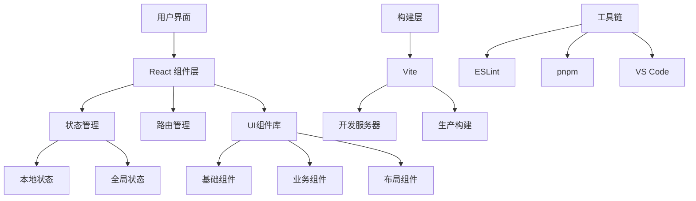
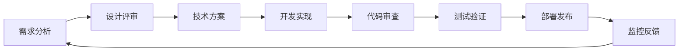

# React 现代化应用开发指南

## 📚 文档目录

- [项目介绍](#项目介绍)
- [技术架构](#技术架构)
- [开发环境](#开发环境)
- [项目结构](#项目结构)
- [开发流程](#开发流程)
- [代码规范](#代码规范)
- [性能优化](#性能优化)
- [部署指南](#部署指南)

---

## 🚀 项目介绍

### 项目概述
my-app 是一个基于 **React 19** 和 **Vite 7** 构建的现代化前端应用模板，专注于提供高性能、可扩展的开发体验。

### 核心特性
- ⚡ **极速开发**: Vite 提供毫秒级热更新
- 🎨 **现代设计**: 渐变背景、毛玻璃效果、流畅动画
- 📱 **响应式**: 完美适配桌面和移动端
- 🧩 **模块化**: 组件化架构，易于维护
- 🔧 **高度可配置**: 支持主题切换和个性化定制
- ⚡ **性能优化**: 懒加载、代码分割、骨架屏

### 技术栈
- **前端框架**: React 19.1.1
- **构建工具**: Vite 7.1.2
- **代码规范**: ESLint 9.33.0
- **包管理**: pnpm
- **样式**: 现代化 CSS + CSS Variables
- **图标**: Unicode Emoji + CSS图形

---

## 🏗️ 技术架构

### 架构图


### 分层设计

#### 1. 展示层 (Presentation Layer)
- **组件**: 可复用的UI组件
- **页面**: 业务页面组件
- **布局**: 页面布局组件

#### 2. 逻辑层 (Logic Layer)
- **Hooks**: 自定义业务逻辑
- **Utils**: 工具函数
- **Services**: 数据服务

#### 3. 数据层 (Data Layer)
- **State**: 状态管理
- **Cache**: 数据缓存
- **API**: 接口调用

---

## 💻 开发环境

### 系统要求
- **Node.js**: >= 18.0.0
- **pnpm**: >= 8.0.0
- **操作系统**: Windows 10+, macOS 10.14+, Linux

### 快速开始

```bash
# 1. 克隆项目
git clone <project-url>
cd my-app

# 2. 安装依赖
pnpm install

# 3. 启动开发服务器
pnpm dev

# 4. 打开浏览器
# http://localhost:5173
```

### 开发工具
- **IDE**: VS Code (推荐)
- **插件**: 
  - ES7+ React/Redux/React-Native snippets
  - Auto Rename Tag
  - Bracket Pair Colorizer
  - GitLens
  - Prettier

### 环境变量
```bash
# .env.development
VITE_APP_TITLE=React 现代化应用
VITE_API_BASE_URL=http://localhost:3000
VITE_DEBUG=true

# .env.production
VITE_APP_TITLE=React App
VITE_API_BASE_URL=https://api.example.com
VITE_DEBUG=false
```

---

## 📂 项目结构

```
my-app/
├── docs/                     # 📚 项目文档
│   ├── project/             # 项目相关文档
│   ├── components/          # 组件文档
│   ├── development/         # 开发指南
│   └── design/             # 设计规范
├── src/                     # 🎯 源代码
│   ├── components/         # 📦 可复用组件
│   │   ├── Profile.jsx     # 个人资料组件
│   │   ├── ProjectDetail.jsx # 项目详情组件
│   │   ├── SkillChart.jsx  # 技能图表组件
│   │   └── ActivityCalendar.jsx # 活动日历组件
│   ├── hooks/              # 🪝 自定义Hooks (计划)
│   ├── utils/              # 🔧 工具函数 (计划)
│   ├── styles/             # 🎨 样式文件 (计划)
│   │   ├── globals.css     # 全局样式
│   │   ├── components.css  # 组件样式
│   │   └── themes/         # 主题文件
│   ├── App.jsx             # 🏠 根组件
│   ├── App.css             # 应用样式
│   ├── index.css           # 全局样式
│   └── main.jsx            # 🚀 应用入口
├── public/                  # 📁 静态资源
│   └── vite.svg            # Logo
├── dist/                    # 📦 构建输出 (自动生成)
├── package.json            # 📋 项目配置
├── vite.config.js          # ⚙️ Vite配置
├── eslint.config.js        # 📏 ESLint配置
└── README.md               # 📖 项目说明
```

### 组件组织规范

```
components/
├── common/                 # 通用组件
│   ├── Button/
│   │   ├── index.jsx
│   │   ├── Button.css
│   │   └── Button.stories.js (计划)
│   └── Modal/
├── business/              # 业务组件
│   ├── Profile/
│   └── ProjectList/
└── layout/               # 布局组件
    ├── Header/
    ├── Sidebar/
    └── Footer/
```

---

## 🔄 开发流程

### 工作流程



### 分支管理

```bash
# 主分支
main                    # 生产环境代码
develop                 # 开发环境代码

# 功能分支
feature/component-lib   # 组件库开发
feature/performance     # 性能优化
feature/testing        # 测试集成

# 修复分支
hotfix/critical-bug    # 紧急bug修复
```

### 提交规范

```bash
# 格式: type(scope): description

# 示例
feat(components): 添加Button组件
fix(style): 修复响应式布局问题
docs(readme): 更新安装说明
style(css): 优化动画效果
refactor(hooks): 重构useAuth Hook
test(utils): 添加工具函数测试
perf(lazy): 实现组件懒加载
```

### 开发步骤

#### 1. 新功能开发
```bash
# 1. 创建功能分支
git checkout -b feature/new-feature

# 2. 开发实现
# 编写代码...

# 3. 代码检查
pnpm lint

# 4. 测试验证
pnpm test (计划)

# 5. 提交代码
git add .
git commit -m "feat: 添加新功能"

# 6. 合并请求
git push origin feature/new-feature
```

#### 2. 组件开发
```bash
# 1. 创建组件目录
mkdir src/components/NewComponent

# 2. 创建组件文件
touch src/components/NewComponent/index.jsx
touch src/components/NewComponent/NewComponent.css

# 3. 实现组件
# 编写JSX和CSS...

# 4. 添加文档
touch docs/components/NewComponent.md

# 5. 集成到应用
# 在App.jsx中引入使用
```

---

## 📏 代码规范

### JavaScript/JSX 规范

#### 1. 组件定义
```jsx
// ✅ 推荐: 函数组件
function ComponentName({ prop1, prop2 }) {
  // 组件逻辑
  return <div>...</div>
}

// ❌ 避免: 类组件 (除非必要)
class ComponentName extends React.Component {
  render() {
    return <div>...</div>
  }
}
```

#### 2. Hooks使用
```jsx
// ✅ 推荐: 统一Hooks规范
function MyComponent() {
  // 1. useState
  const [state, setState] = useState(initialState)
  
  // 2. useEffect
  useEffect(() => {
    // 副作用逻辑
  }, [dependency])
  
  // 3. 自定义Hooks
  const customData = useCustomHook()
  
  return <div>...</div>
}
```

#### 3. 事件处理
```jsx
// ✅ 推荐: 使用useCallback优化
const handleClick = useCallback((event) => {
  // 处理逻辑
}, [dependency])

// ✅ 推荐: 明确的事件命名
const handleSubmit = () => {}
const handleInputChange = () => {}
const handleModalClose = () => {}
```

### CSS 规范

#### 1. 命名规范
```css
/* ✅ 推荐: BEM命名 */
.component-name {}
.component-name__element {}
.component-name--modifier {}

/* ✅ 推荐: 语义化类名 */
.button {}
.button--primary {}
.button--large {}
.button__icon {}
```

#### 2. CSS变量使用
```css
/* ✅ 推荐: 使用CSS变量 */
:root {
  --primary-color: #646cff;
  --secondary-color: #61dafb;
  --border-radius: 8px;
  --transition: all 0.3s ease;
}

.button {
  background: var(--primary-color);
  border-radius: var(--border-radius);
  transition: var(--transition);
}
```

#### 3. 响应式设计
```css
/* ✅ 推荐: 移动优先 */
.component {
  /* 移动端样式 */
}

@media (min-width: 768px) {
  .component {
    /* 平板样式 */
  }
}

@media (min-width: 1024px) {
  .component {
    /* 桌面样式 */
  }
}
```

### 文件组织规范

#### 1. 导入顺序
```jsx
// ✅ 推荐的导入顺序
// 1. React相关
import React, { useState, useEffect } from 'react'

// 2. 第三方库
import classNames from 'classnames'

// 3. 内部组件
import Button from './Button'
import Modal from './Modal'

// 4. 工具函数
import { formatDate } from '../utils'

// 5. 样式文件
import './Component.css'
```

#### 2. 导出规范
```jsx
// ✅ 推荐: 默认导出组件
function Component() {
  return <div>...</div>
}

export default Component

// ✅ 推荐: 命名导出工具
export { formatDate, validateEmail }
```

---

## ⚡ 性能优化

### 已实现的优化

#### 1. 懒加载
```jsx
// 组件懒加载
const ProjectDetail = lazy(() => import('./components/ProjectDetail'))
const Profile = lazy(() => import('./components/Profile'))

// 使用Suspense包装
<Suspense fallback={<LoadingSpinner />}>
  <ProjectDetail />
</Suspense>
```

#### 2. 代码分割
```jsx
// 路由级别分割
const HomePage = lazy(() => import('./pages/Home'))
const AboutPage = lazy(() => import('./pages/About'))

// 功能级别分割
const ChartComponent = lazy(() => import('./components/Chart'))
```

### 计划中的优化

#### 1. 虚拟滚动
```jsx
// 大列表优化
import { FixedSizeList as List } from 'react-window'

function VirtualList({ items }) {
  return (
    <List
      height={600}
      itemCount={items.length}
      itemSize={80}
    >
      {({ index, style }) => (
        <div style={style}>
          {items[index]}
        </div>
      )}
    </List>
  )
}
```

#### 2. 图片优化
```jsx
// 图片懒加载
function LazyImage({ src, alt }) {
  const [isLoaded, setIsLoaded] = useState(false)
  const imgRef = useRef()

  useEffect(() => {
    const observer = new IntersectionObserver(
      ([entry]) => {
        if (entry.isIntersecting) {
          setIsLoaded(true)
          observer.disconnect()
        }
      }
    )
    
    if (imgRef.current) {
      observer.observe(imgRef.current)
    }

    return () => observer.disconnect()
  }, [])

  return (
    <div ref={imgRef}>
      {isLoaded && }
    </div>
  )
}
```

### 性能监控

```jsx
// Web Vitals 监控
import { getCLS, getFID, getFCP, getLCP, getTTFB } from 'web-vitals'

function sendToAnalytics(metric) {
  // 发送到分析服务
  console.log(metric)
}

getCLS(sendToAnalytics)
getFID(sendToAnalytics)
getFCP(sendToAnalytics)
getLCP(sendToAnalytics)
getTTFB(sendToAnalytics)
```

---

## 🚀 部署指南

### 构建命令
```bash
# 开发环境
pnpm dev

# 生产构建
pnpm build

# 预览构建结果
pnpm preview

# 代码检查
pnpm lint
```

### 部署配置

#### 1. Vercel 部署
```json
{
  "buildCommand": "pnpm build",
  "outputDirectory": "dist",
  "framework": "vite"
}
```

#### 2. Netlify 部署
```toml
[build]
  command = "pnpm build"
  publish = "dist"

[[redirects]]
  from = "/*"
  to = "/index.html"
  status = 200
```

#### 3. Docker 部署
```dockerfile
FROM node:18-alpine
WORKDIR /app
COPY package*.json ./
RUN npm install
COPY . .
RUN npm run build
EXPOSE 3000
CMD ["npm", "run", "preview"]
```

### 环境配置
```bash
# 生产环境优化
VITE_NODE_ENV=production
VITE_COMPRESS=true
VITE_ANALYZE=false
```

---

## 🔗 相关链接

- [React 官方文档](https://react.dev/)
- [Vite 官方文档](https://vitejs.dev/)
- [ESLint 配置指南](https://eslint.org/)
- [pnpm 使用指南](https://pnpm.io/)

---

**维护者**: 开发团队  
**最后更新**: 2024年9月1日  
**版本**: v1.0.0