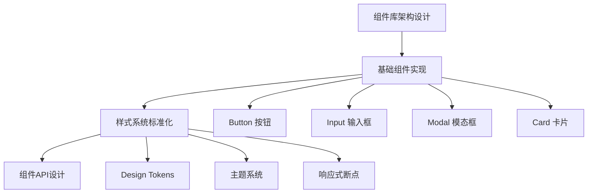

# React 现代化应用 - 下一步推进方向

## 🎯 战略规划概览

基于当前项目75%的完成度，制定接下来3个月的详细推进计划，重点聚焦**可复用UI组件库建设**。

---

## 📋 优先级矩阵

| 优先级 | 模块 | 预期收益 | 实施难度 | 时间投入 |
|--------|------|----------|----------|----------|
| 🔥 **P0** | 可复用UI组件库 | 高 | 中 | 3周 |
| 🔥 **P0** | 样式系统标准化 | 高 | 低 | 1周 |
| ⚡ **P1** | 组件文档系统 | 中 | 中 | 2周 |
| ⚡ **P1** | TypeScript集成 | 高 | 中 | 1周 |
| 🚀 **P2** | 性能优化进阶 | 中 | 高 | 2周 |
| 📦 **P3** | 状态管理集成 | 中 | 中 | 1周 |

---

## 🏗️ 阶段一：UI组件库建设 (第1-3周)

### 目标
建立一套**高质量、可复用、文档完善**的UI组件库，为项目提供统一的设计语言和开发效率。

### 核心任务

#### Week 1: 基础组件库架构


##### 1.1 目录结构设计
```
src/
├── components/
│   ├── ui/                 # 🎨 UI组件库
│   │   ├── Button/
│   │   │   ├── index.jsx
│   │   │   ├── Button.css
│   │   │   ├── Button.types.js
│   │   │   └── __tests__/
│   │   ├── Input/
│   │   ├── Modal/
│   │   ├── Card/
│   │   └── index.js        # 统一导出
│   ├── business/           # 🏢 业务组件
│   │   ├── Profile/
│   │   ├── ProjectDetail/
│   │   └── Dashboard/
│   └── layout/             # 📐 布局组件
│       ├── Header/
│       ├── Sidebar/
│       └── Footer/
├── styles/                 # 🎨 样式系统
│   ├── tokens.css          # 设计令牌
│   ├── themes/             # 主题文件
│   ├── mixins.css          # CSS混入
│   └── utilities.css       # 工具类
└── hooks/                  # 🪝 自定义Hooks
    ├── useTheme.js
    ├── useLocalStorage.js
    └── useDebounce.js
```

##### 1.2 设计令牌系统
```css
/* styles/tokens.css */
:root {
  /* 🎨 颜色系统 */
  --color-primary-50: #eff6ff;
  --color-primary-100: #dbeafe;
  --color-primary-500: #3b82f6;
  --color-primary-600: #2563eb;
  --color-primary-900: #1e3a8a;
  
  /* 📏 尺寸系统 */
  --size-1: 0.25rem;    /* 4px */
  --size-2: 0.5rem;     /* 8px */
  --size-4: 1rem;       /* 16px */
  --size-8: 2rem;       /* 32px */
  
  /* 📝 字体系统 */
  --font-size-xs: 0.75rem;
  --font-size-sm: 0.875rem;
  --font-size-base: 1rem;
  --font-size-lg: 1.125rem;
  --font-size-xl: 1.25rem;
  
  /* 🎭 阴影系统 */
  --shadow-sm: 0 1px 2px 0 rgb(0 0 0 / 0.05);
  --shadow-md: 0 4px 6px -1px rgb(0 0 0 / 0.1);
  --shadow-lg: 0 10px 15px -3px rgb(0 0 0 / 0.1);
  
  /* ⚡ 动画系统 */
  --duration-150: 150ms;
  --duration-300: 300ms;
  --ease-in-out: cubic-bezier(0.4, 0, 0.2, 1);
}
```

#### Week 2: 核心组件实现

##### 2.1 Button 组件
```jsx
// components/ui/Button/index.jsx
import { forwardRef } from 'react'
import classNames from 'classnames'
import './Button.css'

const Button = forwardRef(({
  children,
  variant = 'primary',
  size = 'medium',
  disabled = false,
  loading = false,
  icon,
  iconPosition = 'left',
  className,
  ...props
}, ref) => {
  const buttonClasses = classNames(
    'btn',
    `btn--${variant}`,
    `btn--${size}`,
    {
      'btn--loading': loading,
      'btn--disabled': disabled,
      'btn--icon-only': !children && icon,
    },
    className
  )

  return (
    <button
      ref={ref}
      className={buttonClasses}
      disabled={disabled || loading}
      {...props}
    >
      {loading && <span className="btn__spinner" />}
      {icon && iconPosition === 'left' && (
        <span className="btn__icon btn__icon--left">{icon}</span>
      )}
      {children && <span className="btn__text">{children}</span>}
      {icon && iconPosition === 'right' && (
        <span className="btn__icon btn__icon--right">{icon}</span>
      )}
    </button>
  )
})

Button.displayName = 'Button'
export default Button
```

##### 2.2 Input 组件
```jsx
// components/ui/Input/index.jsx
import { forwardRef, useState } from 'react'
import classNames from 'classnames'
import './Input.css'

const Input = forwardRef(({
  label,
  error,
  hint,
  size = 'medium',
  variant = 'outline',
  prefix,
  suffix,
  className,
  ...props
}, ref) => {
  const [focused, setFocused] = useState(false)

  const inputClasses = classNames(
    'input',
    `input--${variant}`,
    `input--${size}`,
    {
      'input--focused': focused,
      'input--error': error,
      'input--with-prefix': prefix,
      'input--with-suffix': suffix,
    },
    className
  )

  return (
    <div className="input-wrapper">
      {label && (
        <label className="input__label">
          {label}
          {props.required && <span className="input__required">*</span>}
        </label>
      )}
      
      <div className="input__container">
        {prefix && <span className="input__prefix">{prefix}</span>}
        <input
          ref={ref}
          className={inputClasses}
          onFocus={() => setFocused(true)}
          onBlur={() => setFocused(false)}
          {...props}
        />
        {suffix && <span className="input__suffix">{suffix}</span>}
      </div>
      
      {error && <span className="input__error">{error}</span>}
      {hint && !error && <span className="input__hint">{hint}</span>}
    </div>
  )
})

Input.displayName = 'Input'
export default Input
```

#### Week 3: 高级组件与集成

##### 3.1 Modal 组件
```jsx
// components/ui/Modal/index.jsx
import { useEffect, useRef } from 'react'
import { createPortal } from 'react-dom'
import classNames from 'classnames'
import './Modal.css'

function Modal({
  isOpen,
  onClose,
  title,
  children,
  size = 'medium',
  closeOnOverlay = true,
  closeOnEscape = true,
  className
}) {
  const modalRef = useRef()

  useEffect(() => {
    if (!isOpen) return

    const handleEscape = (event) => {
      if (closeOnEscape && event.key === 'Escape') {
        onClose()
      }
    }

    document.addEventListener('keydown', handleEscape)
    document.body.style.overflow = 'hidden'

    return () => {
      document.removeEventListener('keydown', handleEscape)
      document.body.style.overflow = 'unset'
    }
  }, [isOpen, closeOnEscape, onClose])

  if (!isOpen) return null

  const modalClasses = classNames(
    'modal',
    `modal--${size}`,
    className
  )

  return createPortal(
    <div 
      className="modal-overlay"
      onClick={closeOnOverlay ? onClose : undefined}
    >
      <div 
        ref={modalRef}
        className={modalClasses}
        onClick={(e) => e.stopPropagation()}
      >
        <div className="modal__header">
          <h3 className="modal__title">{title}</h3>
          <button 
            className="modal__close"
            onClick={onClose}
            aria-label="关闭"
          >
            ✕
          </button>
        </div>
        <div className="modal__body">
          {children}
        </div>
      </div>
    </div>,
    document.body
  )
}

export default Modal
```

##### 3.2 组件库统一导出
```jsx
// components/ui/index.js
export { default as Button } from './Button'
export { default as Input } from './Input'
export { default as Modal } from './Modal'
export { default as Card } from './Card'
export { default as Badge } from './Badge'
export { default as Spinner } from './Spinner'
export { default as Tooltip } from './Tooltip'
export { default as Dropdown } from './Dropdown'
```

### 可交付成果
- ✅ 8-10个基础UI组件
- ✅ 完整的设计令牌系统
- ✅ 组件API文档
- ✅ 使用示例代码

---

## 🎨 阶段二：样式系统标准化 (第4周)

### 目标
建立统一的样式规范和主题系统，提高开发效率和设计一致性。

### 核心任务

#### 4.1 主题系统重构
```jsx
// hooks/useTheme.js
import { createContext, useContext, useState, useEffect } from 'react'

const ThemeContext = createContext()

export function ThemeProvider({ children }) {
  const [theme, setTheme] = useState(() => {
    return localStorage.getItem('theme') || 'dark'
  })

  useEffect(() => {
    document.documentElement.setAttribute('data-theme', theme)
    localStorage.setItem('theme', theme)
  }, [theme])

  const toggleTheme = () => {
    setTheme(prev => prev === 'dark' ? 'light' : 'dark')
  }

  return (
    <ThemeContext.Provider value={{ theme, setTheme, toggleTheme }}>
      {children}
    </ThemeContext.Provider>
  )
}

export const useTheme = () => {
  const context = useContext(ThemeContext)
  if (!context) {
    throw new Error('useTheme must be used within ThemeProvider')
  }
  return context
}
```

#### 4.2 响应式断点系统
```css
/* styles/breakpoints.css */
:root {
  --breakpoint-sm: 640px;
  --breakpoint-md: 768px;
  --breakpoint-lg: 1024px;
  --breakpoint-xl: 1280px;
  --breakpoint-2xl: 1536px;
}

/* 响应式混入 */
@media (min-width: 640px) {
  .sm\:block { display: block; }
  .sm\:hidden { display: none; }
  .sm\:flex { display: flex; }
}

@media (min-width: 768px) {
  .md\:block { display: block; }
  .md\:hidden { display: none; }
  .md\:grid { display: grid; }
}
```

### 可交付成果
- ✅ 完整的主题系统
- ✅ 响应式工具类
- ✅ CSS架构指南
- ✅ 样式规范文档

---

## 📚 阶段三：组件文档系统 (第5-6周)

### 目标
建立完善的组件文档和示例系统，提升开发体验和团队协作效率。

### 技术选型
- **文档工具**: Storybook 或自定义文档站点
- **示例管理**: MDX格式
- **交互演示**: 在线编辑器

#### 6.1 Storybook 集成
```bash
# 安装 Storybook
npx storybook@latest init

# 配置文件
# .storybook/main.js
export default {
  stories: ['../src/**/*.stories.@(js|jsx|ts|tsx|mdx)'],
  addons: [
    '@storybook/addon-essentials',
    '@storybook/addon-docs',
    '@storybook/addon-controls',
    '@storybook/addon-a11y',
  ],
  framework: {
    name: '@storybook/react-vite',
    options: {},
  },
}
```

#### 6.2 组件Story示例
```jsx
// Button.stories.jsx
import Button from './Button'

export default {
  title: 'UI/Button',
  component: Button,
  parameters: {
    docs: {
      description: {
        component: '通用按钮组件，支持多种样式和状态'
      }
    }
  },
  argTypes: {
    variant: {
      control: 'select',
      options: ['primary', 'secondary', 'danger', 'ghost']
    },
    size: {
      control: 'select',
      options: ['small', 'medium', 'large']
    }
  }
}

export const Primary = {
  args: {
    children: '主要按钮',
    variant: 'primary'
  }
}

export const AllVariants = () => (
  <div style={{ display: 'flex', gap: '1rem' }}>
    <Button variant="primary">Primary</Button>
    <Button variant="secondary">Secondary</Button>
    <Button variant="danger">Danger</Button>
    <Button variant="ghost">Ghost</Button>
  </div>
)
```

### 可交付成果
- ✅ Storybook文档站点
- ✅ 组件API文档
- ✅ 交互式示例
- ✅ 使用指南

---

## ⚡ 阶段四：性能优化进阶 (第7-8周)

### 目标
实现更深层次的性能优化，提升用户体验和应用性能指标。

#### 7.1 虚拟滚动实现
```jsx
// components/VirtualList/index.jsx
import { useState, useEffect, useMemo } from 'react'
import './VirtualList.css'

function VirtualList({
  items,
  itemHeight = 50,
  containerHeight = 400,
  renderItem,
  overscan = 5
}) {
  const [scrollTop, setScrollTop] = useState(0)

  const visibleItems = useMemo(() => {
    const startIndex = Math.floor(scrollTop / itemHeight)
    const endIndex = Math.min(
      startIndex + Math.ceil(containerHeight / itemHeight) + overscan,
      items.length
    )

    return items.slice(startIndex, endIndex).map((item, index) => ({
      item,
      index: startIndex + index
    }))
  }, [items, scrollTop, itemHeight, containerHeight, overscan])

  return (
    <div 
      className="virtual-list"
      style={{ height: containerHeight }}
      onScroll={(e) => setScrollTop(e.target.scrollTop)}
    >
      <div style={{ height: items.length * itemHeight, position: 'relative' }}>
        {visibleItems.map(({ item, index }) => (
          <div
            key={index}
            style={{
              position: 'absolute',
              top: index * itemHeight,
              height: itemHeight,
              width: '100%'
            }}
          >
            {renderItem(item, index)}
          </div>
        ))}
      </div>
    </div>
  )
}

export default VirtualList
```

#### 7.2 图片懒加载Hook
```jsx
// hooks/useImageLazyLoad.js
import { useState, useRef, useEffect } from 'react'

export function useImageLazyLoad() {
  const [isLoaded, setIsLoaded] = useState(false)
  const [isInView, setIsInView] = useState(false)
  const imgRef = useRef()

  useEffect(() => {
    const observer = new IntersectionObserver(
      ([entry]) => {
        if (entry.isIntersecting) {
          setIsInView(true)
          observer.disconnect()
        }
      },
      { threshold: 0.1 }
    )

    if (imgRef.current) {
      observer.observe(imgRef.current)
    }

    return () => observer.disconnect()
  }, [])

  return {
    imgRef,
    isLoaded,
    isInView,
    setIsLoaded
  }
}
```

### 可交付成果
- ✅ 虚拟滚动组件
- ✅ 图片懒加载系统
- ✅ 性能监控集成
- ✅ 性能优化指南

---

## 📦 阶段五：TypeScript集成 (第9周)

### 目标
为项目添加类型安全保障，提升开发体验和代码质量。

#### 9.1 TypeScript配置
```json
// tsconfig.json
{
  "compilerOptions": {
    "target": "ES2020",
    "useDefineForClassFields": true,
    "lib": ["ES2020", "DOM", "DOM.Iterable"],
    "module": "ESNext",
    "skipLibCheck": true,
    "moduleResolution": "bundler",
    "allowImportingTsExtensions": true,
    "resolveJsonModule": true,
    "isolatedModules": true,
    "noEmit": true,
    "jsx": "react-jsx",
    "strict": true,
    "noUnusedLocals": true,
    "noUnusedParameters": true,
    "noFallthroughCasesInSwitch": true,
    "baseUrl": ".",
    "paths": {
      "@/*": ["src/*"],
      "@/components/*": ["src/components/*"],
      "@/hooks/*": ["src/hooks/*"],
      "@/utils/*": ["src/utils/*"]
    }
  },
  "include": ["src"],
  "references": [{ "path": "./tsconfig.node.json" }]
}
```

#### 9.2 组件类型定义
```typescript
// types/components.ts
export interface ButtonProps {
  children?: React.ReactNode
  variant?: 'primary' | 'secondary' | 'danger' | 'ghost'
  size?: 'small' | 'medium' | 'large'
  disabled?: boolean
  loading?: boolean
  icon?: React.ReactNode
  iconPosition?: 'left' | 'right'
  onClick?: (event: React.MouseEvent<HTMLButtonElement>) => void
}

export interface InputProps {
  label?: string
  error?: string
  hint?: string
  size?: 'small' | 'medium' | 'large'
  variant?: 'outline' | 'filled' | 'ghost'
  prefix?: React.ReactNode
  suffix?: React.ReactNode
  value?: string
  onChange?: (event: React.ChangeEvent<HTMLInputElement>) => void
}
```

### 可交付成果
- ✅ TypeScript配置完成
- ✅ 组件类型定义
- ✅ 工具函数类型
- ✅ 类型检查集成

---

## 🎯 成功指标

### 技术指标
- **组件数量**: 15-20个高质量组件
- **文档覆盖率**: 100%
- **类型覆盖率**: 90%+
- **性能提升**: FCP < 800ms, LCP < 1.2s

### 业务指标
- **开发效率**: 组件复用率 > 80%
- **代码质量**: ESLint零错误
- **维护成本**: 技术债务 < 10%
- **团队协作**: 文档完整度 > 95%

---

## 🗓️ 详细时间表

### 第1-3周：UI组件库建设
```
Week 1 (Sep 2-8):
├── Day 1-2: 架构设计与项目搭建
├── Day 3-4: 设计令牌系统
├── Day 5-7: Button + Input 组件

Week 2 (Sep 9-15):
├── Day 1-2: Modal + Card 组件
├── Day 3-4: Badge + Spinner 组件
├── Day 5-7: 组件测试与优化

Week 3 (Sep 16-22):
├── Day 1-2: Tooltip + Dropdown 组件
├── Day 3-4: 组件库集成测试
├── Day 5-7: 文档编写与示例
```

### 第4周：样式系统标准化
```
Week 4 (Sep 23-29):
├── Day 1-2: 主题系统重构
├── Day 3-4: 响应式工具类
├── Day 5-7: 样式规范文档
```

### 第5-6周：文档系统建设
```
Week 5 (Sep 30-Oct 6):
├── Day 1-3: Storybook 配置
├── Day 4-7: 组件Story编写

Week 6 (Oct 7-13):
├── Day 1-3: API文档生成
├── Day 4-7: 使用指南编写
```

### 第7-8周：性能优化
```
Week 7 (Oct 14-20):
├── Day 1-3: 虚拟滚动实现
├── Day 4-7: 图片懒加载系统

Week 8 (Oct 21-27):
├── Day 1-3: 性能监控集成
├── Day 4-7: 优化效果验证
```

### 第9周：TypeScript集成
```
Week 9 (Oct 28-Nov 3):
├── Day 1-2: TS配置与迁移
├── Day 3-5: 类型定义编写
├── Day 6-7: 类型检查修复
```

---

## 💡 风险预案

### 技术风险
1. **组件API设计复杂**: 采用渐进式设计，先简后繁
2. **性能优化效果不明显**: 建立基准测试，量化效果
3. **TypeScript迁移困难**: 分模块渐进式迁移

### 时间风险
1. **开发进度延迟**: 采用MVP方式，核心功能优先
2. **文档编写耗时**: 边开发边写文档，减少后期压力

### 团队风险
1. **新技术学习成本**: 提供培训材料和示例代码
2. **代码规范不统一**: 建立clear的code review流程

---

## 🚀 后续规划 (第10-12周)

### 状态管理集成
- Zustand 状态管理
- 数据持久化
- 状态同步机制

### 测试体系建设
- Jest + React Testing Library
- 组件单元测试
- E2E测试集成

### 工程化完善
- CI/CD流程
- 代码质量检查
- 自动化部署

---

**制定者**: 项目开发团队  
**审核者**: 技术负责人  
**最后更新**: 2024年9月1日  
**版本**: v2.0